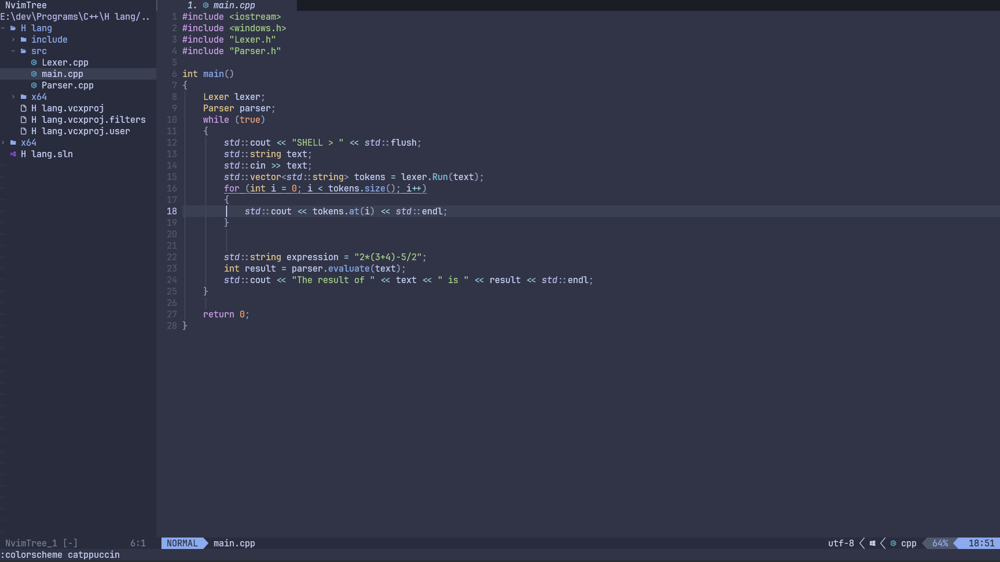

#  My neovim configuration

**this is my cool neovim configuration written in 100% lua 👌**

## Intall on windows 
**to install, delete your nvim folder and then run this command:**

```bassh
git clone https://github.com/sijanthapa171/nvim.git %USERPROFILE%\appdata\local\nvim
```

**change the output path as needed. It will most likely be different on macos and linux.**

## For linux
```bash
git clone https://github.com//nvim ~/.config/nvim && nvim
```

**also if you are using a terminal with neovim such as powershell, command prompt or any other terminal emulator, then download a nerd font.**

**a nerd font is required to see all the symbols that neovim uses.**

**the nerd font that i recommend is JetBrainsMono nerd font https://www.jetbrains.com/lp/mono/**

**all Keymaps can be found in lua\core\keymaps.lua**

**now you should be set up, Have fun coding :)**

**this is what the config looks like**


**you can open the terminal with Alt+F**
