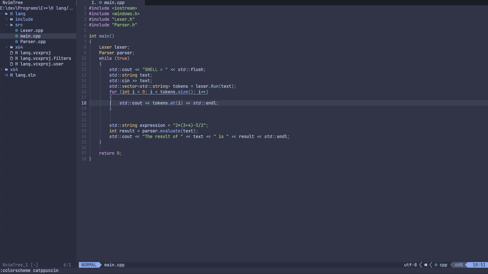
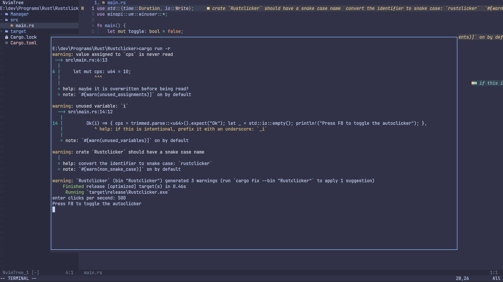

#  My neovim configuration

this is my cool neovim configuration written in 100% lua 👌

to install, delete your nvim folder and then run: git clone https://github.com/sijanthapa171/nvim.git %USERPROFILE%\appdata\local\nvim

change the output path as needed. It will most likely be different on macos and linux.

also if you are using a terminal with neovim such as powershell, command prompt or any other terminal emulator, then download a nerd font.

a nerd font is required to see all the symbols that neovim uses.

the nerd font that i recommend is JetBrainsMono nerd font https://www.jetbrains.com/lp/mono/

and then you should be set up, Have fun coding :)

# Demo

