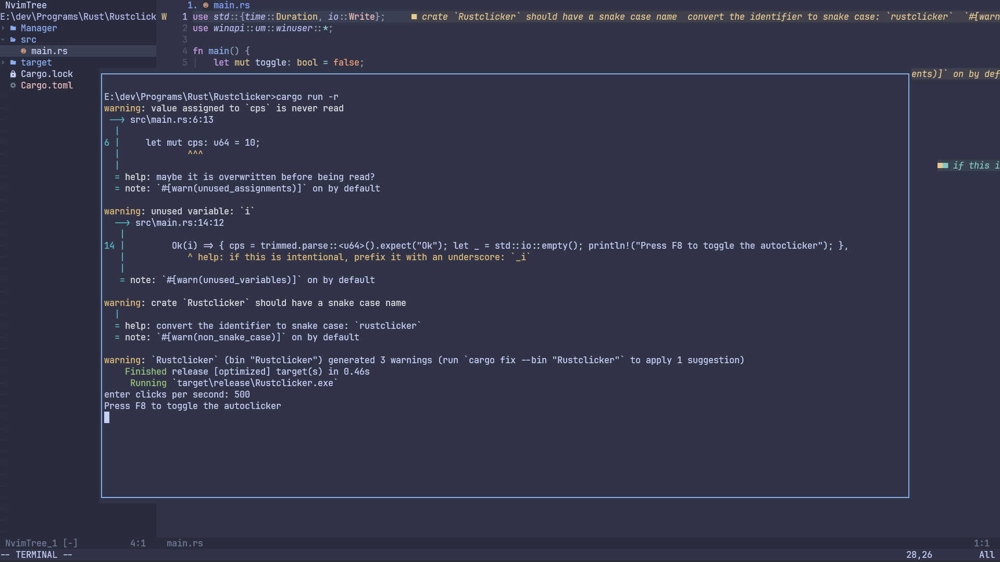

#  My neovim configuration

**This is my cool neovim configuration written in 100% lua 👌**




**To install on windows, delete your nvim folder in %USERPROFILE%\appdata\local\ if you have one there. Then run:**
```shell 
git clone https://github.com/sijanthapa171/nvim.git "%USERPROFILE%\appdata\local\nvim"
```
**Change the output path as needed. It will most likely be different on macos and linux.**
**also if you are using a terminal with neovim such as powershell, command prompt or any other terminal emulator, then download a nerd font.**

**A nerd font is required to see all the symbols that neovim uses.**
**the nerd font that I recommend is JetBrainsMono nerd font https://www.jetbrains.com/lp/mono/**

**All Keymaps can be found in lua\core\keymaps.lua**

**Now you should be set up, have fun programming :)**